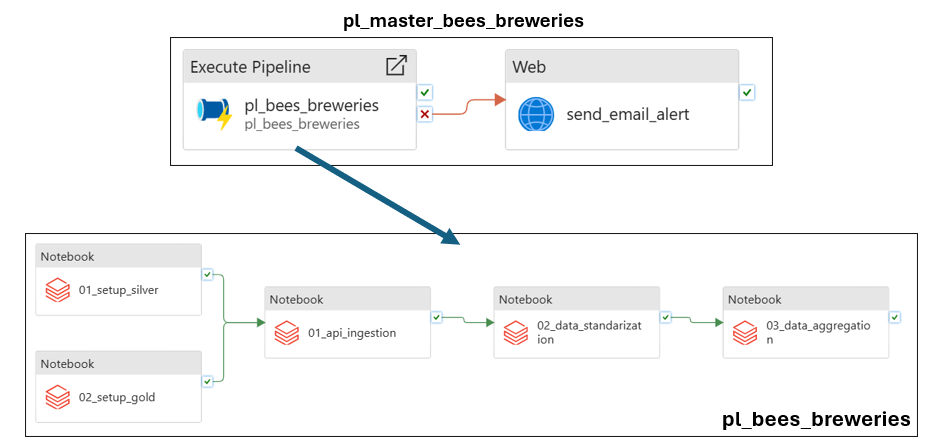

# 🐝 Bees Breweries Data Platform

## 📌 Overview

This project implements an end‑to‑end data ingestion and analytics pipeline for brewery data sourced from the **Open Brewery DB API**.

The solution follows modern **Lakehouse** and **Medallion Architecture** principles, using Azure‑native services and Databricks to deliver a scalable, reliable, and maintainable data platform.

The pipeline ingests raw API data into a **Bronze** layer, applies standardization and data quality rules in the **Silver** layer, and produces a curated analytical dataset in the **Gold** layer.

---

## 🏗️ High‑Level Architecture

```text
Open Brewery DB API
        |
        v
Azure Data Factory (ADF)
        |
        v
Azure Databricks
   ├── Bronze ingestion
   ├── Silver transformation
   └── Gold aggregation
        |
        v
Azure Data Lake Storage Gen2 (Delta Lake)
        |
        v
Analytics / BI / Consumption
```
---

## 🔄 Pipeline Orchestration (ADF)

The pipeline is orchestrated using Azure Data Factory, which triggers Databricks notebooks sequentially.



---

## Architecture Components

### Azure Data Factory (ADF)

- Acts as the orchestration layer.
- Triggers Databricks notebooks in sequence:
  - Bronze ingestion
  - Silver transformation
  - Gold aggregation
- Centralizes scheduling, retries, and dependency management.

---

### Azure Databricks

- Core processing and transformation engine.
- Responsible for:
  - API ingestion logic
  - Data standardization
  - Data quality validation
  - Incremental processing
  - Aggregations and analytics‑ready outputs
- Delta Lake is used as the storage format for Silver and Gold layers.

---

### Azure Data Lake Storage Gen2 (ADLS)

- Central storage layer for the platform.
- Stores:
  - Raw JSON files (Bronze)
  - Delta tables (Silver and Gold)
- Data is organized by ingestion date and run ID to support:
  - Auditability
  - Idempotency
  - Safe reprocessing

---

### Azure Key Vault

- Secure storage of secrets and credentials.
- Integrated with:
  - Azure Data Factory
  - Databricks secret scopes
- Prevents credentials from being exposed in notebooks or pipelines.

---

### Azure Logic Apps (Alerting)

- Provides event‑driven email notifications.
- Triggered on pipeline or job failures.
- Enables proactive operational monitoring.

---

## 🧱 Data Layers

### 🥉 Bronze Layer – Raw Ingestion

**Purpose:**  
Persist raw API responses exactly as received, without transformations.

**Key characteristics:**
- Page‑based ingestion from the Open Brewery DB API.
- Stored as JSON files.
- Folder structure:

```text
ingestion_date=YYYY-MM-DD/
  run_id=YYYYMMDD_HHMMSS/
    breweries_page_*.json
    _SUCCESS
  _LATEST
  _SUCCESS
```

- Marker files (`_SUCCESS`, `_LATEST`) guarantee:
  - Idempotent ingestion
  - Controlled reprocessing
  - Support for multiple runs per day

---

### 🥈 Silver Layer – Standardized & Validated

**Purpose:**  
Clean, normalize, and enrich data while enforcing quality rules.

**Main transformations:**
- Text normalization (trim, capitalization)
- Canonical address resolution
- Latitude and longitude normalization
- Phone number standardization
- Deterministic hash generation for incremental updates

**Data quality flags:**
- `has_proper_encoding`
- `has_address`
- `has_geolocation`
- `has_website`

**Incremental strategy:**
- Hash‑based Delta `MERGE`
- Only changed records are updated

**Fail‑fast validations:**
- Empty dataset detection
- Duplicate primary keys
- Threshold‑based data quality checks

---

### 🥇 Gold Layer – Analytical Aggregation

**Purpose:**  
Provide a business‑ready dataset for analytics and reporting.

**Business definition:**
- Includes only records that:
- Have proper encoding
- Contain a valid address

**Aggregated by:**
- Country
- State
- City
- Brewery type

**Metrics:**
- `brewery_count` (distinct breweries)
- `last_update` timestamp

**Validations:**
- Dataset must not be empty
- Aggregated counts must be positive
- Null grouping keys are logged as warnings

---

## 📂 Repository Structure

```text
databricks/
  sl_breweries/
    setup/
      └── Environment and table setup notebooks
    utils/
      ├── common            # filesystem helpers and markers
      ├── bronze_lib        # API ingestion logic
      ├── silver_transform  # transformations and DQ
      ├── dq                # reusable data quality rules
      └── gold_lib          # gold aggregation logic
    executions/
      ├── 01_bronze_execution
      ├── 02_silver_execution
      └── 03_gold_execution
```

**Design principles:**
- `utils/` contains reusable, modular logic
- `executions/` act as pipeline entrypoints
- Clear separation between orchestration and transformation logic

---

## ⚠️ Environment Constraints (Trial Subscription)

This solution was implemented using an **Azure Trial Subscription**, which introduces specific platform limitations.

Architectural decisions were consciously adapted to remain **production‑realistic while ensuring reproducibility**.

---

### ⚙️ Compute Strategy

- Job Clusters were initially designed for execution.
- Due to compute capacity constraints commonly observed in trial subscriptions, job clusters could not reliably start.

✅ Therefore, an existing **interactive cluster** is used for orchestration execution.

This approach:
- Does not impact pipeline logic
- Mirrors development and lower‑environment enterprise patterns

---

### 🗃️ Metastore Persistence

- The default Hive Metastore in Databricks Standard workspaces does not persist metadata reliably.

**Mitigation strategy:**
- A setup notebook runs at pipeline start
- Databases and tables are created using `IF NOT EXISTS`

This guarantees consistent execution even when metadata is lost between sessions.

---

### Why Unity Catalog Was Not Used

- Unity Catalog would normally be the recommended governance solution.
- Trial account restrictions prevented assigning external metastore permissions.

**Design decision:**
- External metastores were evaluated but intentionally avoided
- The solution remains self‑contained and reproducible

---

## ✅ Engineering Practices Demonstrated

- Medallion Architecture (Bronze / Silver / Gold)
- Incremental processing with Delta `MERGE`
- Idempotent ingestion patterns
- Secure credential management with Key Vault
- Runtime data quality validation
- Centralized orchestration via ADF
- Event‑driven alerting with Logic Apps
- Infrastructure‑aware design decisions

---

## Testing Strategy (Future Work)

Due to time constraints and environment limitations, automated unit tests were not fully implemented.

- Critical data validations are enforced directly in the pipeline runtime
- Core transformation logic was designed to be testable
- In production, this logic would be covered by PySpark unit tests executed in CI

---

## Final Notes

This project demonstrates:
- Practical Lakehouse architecture design
- Strong understanding of Azure data services
- Emphasis on reliability, data quality, and operational robustness
- Conscious trade‑offs aligned with real‑world delivery constraints
